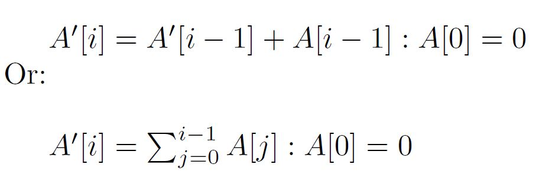

# cuda-parallel-scan-prefix-sum

## Overview

This is an implementation of a work-efficient parallel prefix-sum algorithm on the GPU. The algorithm is also
called scan. Scan is a useful building block for many parallel algorithms, such as radix sort, quicksort, tree
operations, and histograms. Exclusive scan applied to an Array A will produce an Array A', where:

While scan is an appropriate algorithm for any associative operator, this implementation uses addition.
More details about this algorithm can be found in [Mark Harris' report.](https://www.mimuw.edu.pl/~ps209291/kgkp/slides/scan.pdf)

## Execution

* Run "make" to build the executable of this file.
* For debugging, run "make dbg=1" to build a debuggable version of the executable binary.
* Run the binary using "./~name-of-the-artifact~"

There are several modes of operation for the application -

* *No arguments*: Randomly generate input data and compare the GPU's
result against the host's result.
* *One argument*: Randomly generate input data and write the result to the
file specified by the argument.
* *Two arguments*: The first argument specifies a file that contains the array
size. Randomly generate input data and write it to the file specified by
the second argument. (This mode is good for generating test arrays.)
* *Three arguments*: The first argument specifies a file that contains the
array size. The second and third arguments specify the input file and
output file, respectively.

Note that if you wish to use the output of one run of the application as an input,
you must delete the first line in the output file, which displays the accuracy of
the values within the file.
